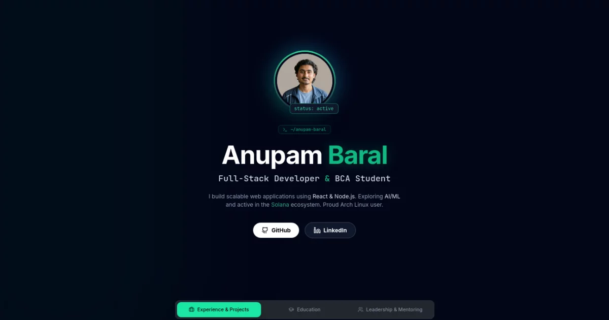

# 🚀 Anupam Baral | Developer Portfolio

A high-performance, interactive personal portfolio built with React, Vite, and Tailwind CSS. Designed with a sleek, glassmorphic "terminal" aesthetic to reflect my background as a Full-Stack Developer, Arch Linux user, and aspiring AI/ML Engineer.

 ## 👨‍💻 About Me

I am a BCA student and developer based in Butwal, Nepal. My technical journey spans across different ecosystems:
* **Full-Stack Web:** Building scalable platforms using React, Node.js, and Express.
* **Web3 & Blockchain:** Developing decentralized applications (dApps) on the Solana ecosystem.
* **Data Science & AI (Current Focus):** Actively deep-diving into **Python, NumPy, and Pandas** to transition into Machine Learning and Artificial Intelligence. 

## ✨ Key Features

* **Glassmorphic UI:** Custom Tailwind configurations for deep-blur backdrops and neon-accented borders.
* **High-Performance Animations:** Powered by `framer-motion` (using `LazyMotion` to keep initial load times under 100ms).
* **Serverless Contact Flow:** Integrated with Web3Forms for secure, backend-free email routing and spam protection (Honeypot).
* **SEO & Social Optimized:** Fully configured OpenGraph and Twitter meta tags for premium link sharing.

## ⚡ Performance Optimizations

This portfolio isn't just a template; it's engineered for speed:
1. **Asset Compression:** Swapped heavy PNGs for next-gen `.webp` formats, reducing image load times by over 90%.
2. **Vite Code Splitting:** Configured Rollup to manually chunk `vendor-react` and `vendor-framer`, keeping the main application bundle incredibly lightweight.
3. **Font Preconnections:** Optimized Google Font delivery to eliminate layout shifts and invisible text flashes.

## 🛠️ Tech Stack

* **Frontend:** React (TypeScript), Tailwind CSS, Framer Motion, Lucide React
* **Build Tool:** Vite (with Rolldown)
* **Deployment:** [Add your hosting platform here, e.g., Vercel / Cloudflare Pages]

## 🚀 Local Setup

Want to run this locally? 

\`\`\`bash
# 1. Clone the repository
git clone https://github.com/gomugomucode/animated-bio-folio.git

# 2. Navigate into the directory
cd animated-bio-folio

# 3. Install dependencies (Bun or NPM)
npm install

# 4. Start the Vite development server
npm run dev
\`\`\`

---
*Built with 💻 and ☕ in Nepal by [Anupam Baral](https://github.com/gomugomucode).*